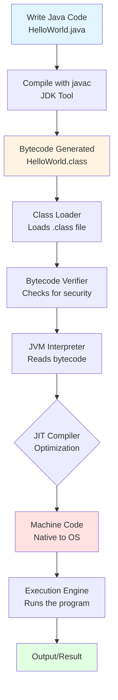

# Java Architecture: JVM, JDK, and JRE Explained

## 📚 Overview

Java's architecture is built on three fundamental components that work together to make Java platform-independent and powerful. Let's understand each one with simple explanations.

---

## 🔧 JDK (Java Development Kit)

### What is JDK?

**JDK** is a complete software development kit used to **develop** Java applications.

### Simple Analogy
Think of JDK as a **complete toolbox** for a carpenter. It contains all the tools needed to build furniture (Java programs).

### What's Inside JDK?
- **Compiler** (`javac`) - Converts Java code to bytecode
- **JRE** - Runtime environment to run Java programs
- **Debugger** - Tools to find and fix errors
- **JavaDoc** - Documentation generator
- **Development Tools** - Various utilities for development

### When Do You Need JDK?
✅ Writing Java code  
✅ Compiling Java programs  
✅ Developing Java applications  

---

## ⚙️ JRE (Java Runtime Environment)

### What is JRE?

**JRE** is the environment required to **run** Java applications.

### Simple Analogy
Think of JRE as a **media player**. You need it to play a movie (run Java programs), but you can't create movies with it.

### What's Inside JRE?
- **JVM** - The engine that runs Java bytecode
- **Class Libraries** - Pre-written Java code (like `String`, `ArrayList`)
- **Supporting Files** - Configuration files and resources

### When Do You Need JRE?
✅ Running Java applications  
✅ Using Java-based software  
❌ NOT for writing or compiling Java code  

---

## 🖥️ JVM (Java Virtual Machine)

### What is JVM?

**JVM** is an abstract machine that **executes** Java bytecode and makes Java platform-independent.

### Simple Analogy
Think of JVM as a **translator**. It translates bytecode (universal language) into machine code that your specific computer understands.

### Key Features
1. **Platform Independence** - "Write Once, Run Anywhere" (WORA)
2. **Memory Management** - Automatic garbage collection
3. **Security** - Provides a secure execution environment
4. **Performance** - Just-In-Time (JIT) compilation for optimization

### JVM Components
- **Class Loader** - Loads `.class` files
- **Bytecode Verifier** - Checks code for security
- **Execution Engine** - Executes bytecode
- **Garbage Collector** - Manages memory automatically

---

## 🔄 Relationship Between JDK, JRE, and JVM

```
┌─────────────────────────────────────────┐
│              JDK                        │
│  (Java Development Kit)                 │
│                                         │
│  ┌───────────────────────────────────┐ │
│  │         JRE                       │ │
│  │  (Java Runtime Environment)       │ │
│  │                                   │ │
│  │  ┌─────────────────────────────┐ │ │
│  │  │       JVM                   │ │ │
│  │  │  (Java Virtual Machine)     │ │ │
│  │  │                             │ │ │
│  │  └─────────────────────────────┘ │ │
│  │                                   │ │
│  │  + Class Libraries                │ │
│  └───────────────────────────────────┘ │
│                                         │
│  + Development Tools (javac, etc.)      │
└─────────────────────────────────────────┘
```

**Key Point:** JDK ⊃ JRE ⊃ JVM

---

## 📊 Java Program Execution Flow



---

## 🎯 Step-by-Step Execution Example

### Step 1: Write Java Code
```java
public class HelloWorld {
    public static void main(String[] args) {
        System.out.println("Hello, World!");
    }
}
```

### Step 2: Compile (Using JDK)
```bash
javac HelloWorld.java
```
**Output:** `HelloWorld.class` (bytecode file)

### Step 3: Run (Using JRE/JVM)
```bash
java HelloWorld
```

### Step 4: JVM Process
1. **Class Loader** loads `HelloWorld.class`
2. **Bytecode Verifier** ensures code is safe
3. **Interpreter** reads bytecode line by line
4. **JIT Compiler** converts frequently used code to machine code
5. **Execution Engine** runs the machine code
6. **Output:** "Hello, World!" appears on screen

---

## 🆚 Quick Comparison Table

| Feature | JDK | JRE | JVM |
|---------|-----|-----|-----|
| **Full Form** | Java Development Kit | Java Runtime Environment | Java Virtual Machine |
| **Purpose** | Develop Java apps | Run Java apps | Execute bytecode |
| **Contains** | JRE + Dev Tools | JVM + Libraries | Execution engine only |
| **For Developers?** | ✅ Yes | ❌ No | ❌ No |
| **For End Users?** | ✅ Yes | ✅ Yes | N/A (part of JRE) |
| **Platform Specific?** | ✅ Yes | ✅ Yes | ✅ Yes |

---

## 💡 Key Takeaways

1. **JDK** = Complete development kit (includes JRE + tools)
2. **JRE** = Runtime environment to run Java programs (includes JVM + libraries)
3. **JVM** = Virtual machine that executes bytecode
4. **Bytecode** = Platform-independent intermediate code
5. **Platform Independence** = Write once, run anywhere (thanks to JVM)

---

## 🔍 Real-World Example

**Scenario:** You download a Java-based game

- **Game Developer** used **JDK** to create the game
- **You (Player)** only need **JRE** to run the game
- **JVM** (inside JRE) translates the game's bytecode to work on your specific computer (Windows/Mac/Linux)

---

## 📝 Summary

```
Developer writes code → JDK compiles to bytecode → 
JRE provides runtime → JVM executes on any platform
```

This architecture is what makes Java truly **platform-independent** and one of the most popular programming languages in the world! 🚀
